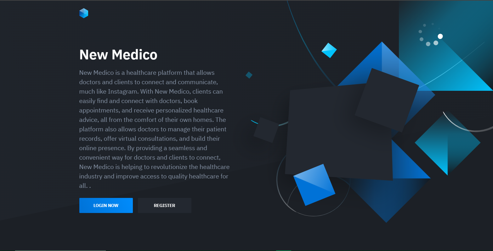

<!DOCTYPE html>
<html>
<head>
 
  <link rel="stylesheet" href="styles.css">
</head>
<body>
  

    
   
  

  

    

      
    

    

    

      
    

    

      <h3>User Registration and Login:</h3>
      
Medico provides a user-friendly registration and login system, allowing doctors and patients to create their accounts and securely log in to the platform. Personal information and credentials are encrypted and stored safely in our database.

    

  

  

    

      
    

    

      <h3>Auto Chat Box:</h3>
      
Our intelligent auto chat box serves as a virtual assistant, enabling real-time communication between doctors and patients. The chat box utilizes natural language processing techniques and predefined algorithms to provide instant responses, answer queries, and offer medical advice based on the symptoms and concerns shared by the patients.

    

  

  

    

      
    

    

      <h3>Appointment Scheduling:</h3>
      
Medico simplifies the appointment booking process. Patients can conveniently view the availability of doctors, select suitable time slots, and schedule appointments through the platform. Doctors receive notifications of new appointments, ensuring efficient time management.

    

  

  

    

      
    

    

      <h3>Secure Messaging:</h3>
      
Medico's secure messaging system allows doctors and patients to exchange messages, ensuring privacy and confidentiality. This feature enables users to ask follow-up questions, share additional information, and receive personalized guidance from doctors outside of scheduled appointments.

    

  

  <!-- Add other features and summaries as needed -->

</body>
</html>
